# Project

#### High-level overview

This is a churn prediction project written and run on spark via PySpark.
Customer records are evaluated and predicted for customer churn with an ML algorithm.
The learning algorithm used can be categorized as an offline supervised binary classifier.

#### Problem domain

The customer records come from a "spotify" type service called "Sparkify", where users can listen to songs,
and perform other typical SOMA actions like give thumbs up or add a friend on the site.
There is a free and a paid membership. The business goal is to predict the probability that paying customers 
will cancel their paid subscription. 
There are data in the dataset that can be used as predictors.

#### Project origin

This project and the accompanying data come from the Data Science Nanodgree capstone project at Udacity.

#### Problem definition

We are trying to extract information from the body of records we have for each user, that will allow us to 
predict their churn behaviour. If such a prediction is positive for a user, business operations have an indication 
that they need to act and possibly convince the user to not cancel his subscription.

#### Solving strategy

The expected solution is to gain a churn prediction f1 score of at least 80%.
There will be a web app where users about to churn are shown and can be searched for.

###### Summary

* Inspect the data to get an idea about what fields to use as predictors.
* Extract and transform this data to form usable features for our learning algorithms.
* Select an algorithm that performs well.
* Apply some tuning to find the best model.
* Build a small presentation web app that uses the model and project data.

The solving strategy involved a classic ETL stage, where data was read in, explored, ideas gathered for features,
then cleaned and transformed into a feature dataset.

Next a good fitting algorithm was searched for, among the PySpark classification algorithms.
In the next step the best algorithm was optimized and fitted once more on the "big" data. 

A big part of the solving strategy was to experiment on smaller data subsets and then to verify 
the findings on larger sets.

#### Metrics

To measure the model performance, we applied standard metrics like the **f1** score.
As it turned out in the initial model training, a low recall score was obtained.

In the case of customer churn, a low recall, which implies a high omission error, is undesirable.
It means a high number of customers will get flagged as non-churners, when instead they are likely to churn.

After some analysis, the reason for this was found to be the unbalanced label data.
As various methods of optimization were applied, it became clear that a proportional relationship
exists between precision and recall.
For this reason, close monitoring of **precision**, **recall**, **accuracy**, **AUC** were added to each training step of all models,
in order to optimize along all of these metrics.   

The metrics were also used in the grid search optimization of the final model.

#### Requirements

The project uses some common libraries like *pandas*, *matplotlib* and *sns*.
Since the project is written in python and spark, we make heavy use of some PySpark libraries,
found within the pyspark package, including but not limited to:

* *pyspark.sql*: Working with pyspark dataframes in general
* *pyspark.sql.functions*: Commonly used functions for counting, summing, aggregating, etc.
* *pyspark.ml.feature*: Used for transformation and feature engineering
* *pyspark.ml.classification*: Spark ML Lib, where the classifiers reside
* *pyspark.ml.evaluation*: Evaluation metrics for the models 

#### Files

###### Files of interest

All notebooks were run and their output saved to corresponding \*.html files.

|Folder     |File                  |About                                                   | Build step |
|-----------|----------------------|--------------------------------------------------------|------|
|.          |etf-fe.ipynb          |ETL and feature engineering notebook                    |1|
|.          |final-model.ipynb     |Creates the final model                                 |4|
|.          |model.ipynb           |Algorithm and modelling                                 |2|
|.          |optimize.pynb         |Optimizes the model                                     |3|
|.          |web.ipynb             |Pre-calculation                                         |5|
|.          |we_pred.ipynb         |Experimental functions for web app                      ||
|app        |run.pyn               |Web app                                                 |6|
|out        |features.parquet      |Transformed, vectorized dataset for training            ||
|out        |model                 |Final model                                             ||
|out        |predictions.parquet   |Pre-calculated user/prediction for web app              ||
|out        |transformed.parquet   |Transformed, but not vectorized dataset                 ||

*Buildstep* refers to the order in which files should be executed to rebuild the project.

If you want to rebuild the project you will need to put the file found at the extracurricular Spark course in lesson _7 [IBM] Starter Code_ into the `/data` folder.
[Link](https://video.udacity-data.com/topher/2018/December/5c1d6681_medium-sparkify-event-data/medium-sparkify-event-data.json)

###### Web App
The web app is built using *flask*.

To install / run:

1. You need a working PySpark environment. Please make sure you have the following languages/libraries installed:

	* Java 1.8
	* Python 3.8.2
	* Spark 3.0.0
	* PySpark 3.0.0
	* numpy 1.19.0
	* scipy 1.4.1
	* flask 1.1.2

2. Check out the project or download it from the github page and extract anywhere to your local filesystem 
3. Navigate to the **"app"** folder in a console (cmd or powershell) and enter:

```
python run.py
```

Then open a browser and in a new tab, enter:

```
https://localhost:3001
```

# Exploration

##### Input set

###### Shape
There are 543705 rows with 18 columns in the input set.

###### Columns

 * artist: string (nullable = true): The artist of the song that was played
 * auth: string (nullable = true): Authentication log for secured application endpoints (LogIn, Cancel...)
 * firstName: string (nullable = true): First name of the user
 * gender: string (nullable = true): User's gender
 * itemInSession: long (nullable = true): Counter for the number of songs played per session
 * lastName: string (nullable = true): Last name of the user
 * length: double (nullable = true): Song length
 * level: string (nullable = true): Subscription level free or paid
 * location: string (nullable = true): User's location
 * method: string (nullable = true): HTTP method of user's request
 * page: string (nullable = true): What page / method the user requested on the site (Play song, Thumbs up...)
 * registration: long (nullable = true): User's registration id
 * sessionId: long (nullable = true): Current session id 
 * song: string (nullable = true): Name of the song played
 * status: long (nullable = true): HTTP status of user's request
 * ts: long (nullable = true): Timestamp at which the event was recorded
 * userAgent: string (nullable = true): The user's browser / agent
 * userId: string (nullable = true): Id of the user
 
 Most of the numerical fields hold integer-type values, but the song "length" can be a float.
 Also this is the field with the largest values.
 
 The "location" field holds the user's city and state. However in some records the state is aggregated as in _TN-MS-AR_.
 
 The "page" column contains a range of actions that the users performed on the site, such as playing a song, adding a friend or cancelling the subscription. 

###### Row example (truncated):

|    Martin Orford|Logged In|   Joseph|     M|           20| Morales|597.55057| free|  Corpus Christi, TX|   PUT|NextSong|1532063507000|      292|Grand Designs|   200|1538352011000|"Mozilla/5.0 (Mac...|   293|

######  Types
	Numerical (7):
	  itemInSession,length,registration,sessionId,status,ts,userId
	  
	Categorical (11):
        artist,auth,firstName,gender,lastName,level,location,method,page,song,userAgent
        
###### Unique values of interest

* Unique users: 449
* Unique locations: 193

###### Sums of interest

* NextSong: 432877
* Thumbs Up: 23826
* Thumbs Down: 4911
* Downgrade: 3811

###### Missing values

* artist: 110828
* firstName: 15700
* gender: 15700
* lastName: 15700
* length: 110828
* location: 15700
* registration: 15700
* song: 110828
* userAgent: 15700

###### Stats of interest

|summary|            length|         sessionId|
|-------|------------------|------------------|
|  count|            432877|            543705|
|   mean|248.66459278007807|2040.8143533717732|
| stddev| 98.41266955052018|1434.3389310782754|
|    min|           0.78322|                 1|
|    max|        3024.66567|              4808|

We see some pretty high deviations.

There were 99 churned users of 449 total. The denormalized churn rate was approx. 24%

##### Abnormalities

After denormalization of the churn label (meaning, every record of every user who churned gets a "1" in that
user's row), I observed that churn was skewed (24%).

In the summed up length column there were some outliers.

##### Descriptive Analysis:

Since I did not have a data description for the dataset, I did some initial exploration.
Here is a simplified summary of what I found and concluded:

firstName, lastName, song and artist:
Not enough data / outside of scope of project. Will all be dropped.

|Column     | Summary | Action |
|-----------|----------|-------|
|ts     | We are not doing a time-series analysis | Drop |
|status | Low distinct values count | Drop |
|method | Completely irrelevant for predictions | Drop |
|registration| Null here means "guest" - cannot be tracked | Drop Rows * |
|auth| All values we could be interested here are already in the "page" column. | Drop |
|userAgent| Too many values, hard to one-hot encode. | Drop |
|itemInSession| Reconstructable from "NextSong" event | Drop |

\* After the rows were dropped, registration served no further purpose and was also dropped.

**Note**: Near the end of the project I decided to also drop the state column.


# Cleaning

Data cleaning was fairly straight-forward since the decisions about it were mostly a result of the data exploration above.
So after deduplication I dropped the columns and rows I had identified as obsolete, and ended up with these
columns remaining:


 * gender
 * length
 * level
 * location
 * page
 * registration
 * sessionId
 * userId

Finally I noticed there were still some missing values in "length" and since I wanted to calculate a sum from 
this, I thought it prudent to fill these with value _**0**_.

After cleaning, the shape of the dataset was:
```
Shape: (528005, 7)
```

# Visualization

After drilling down into the data so deep and becoming very familiar with it, I dod not find it necessary
to include a lot of visualizations. A couple of relationships I was interested in like level to churn,
and a correlation matrix, are shown here:

###### Level / Churn

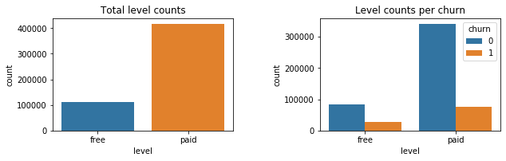

---

###### Gender / Churn

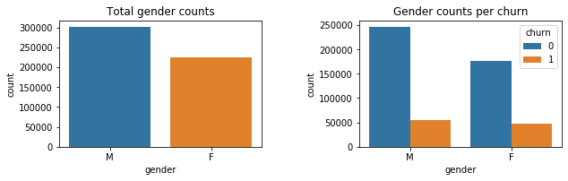

---


###### Correlation Matrix

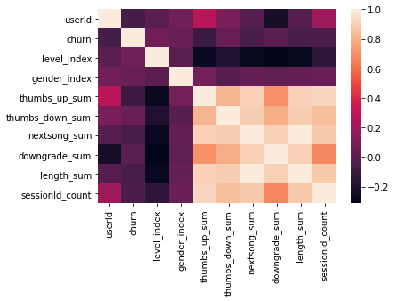


# Transformation

The main task here was to extract the event values from the "page" column and transform them into columns
ready for feature generation.

### Target Label

The event we were most interested in of course is the churn event, which was present as "Cancellation Confirmation". 
The extraction here was a bit tricky since I needed to denormalize these events per user conditionally (The
condition being that the user churned)
I opted to implement this in a two-stage solution:

1. Build a list *Uc* of all **userId**s that did churn
2. Add a new column with an udf that checks the condition: **userId** is present in *Uc* 

### Features

The columns "level" and "gender" were one-hot encoded with StringIndexer.
The columns "length" and "sessionId"  were aggregated by sum and distinct sum.

Denormalization followed a similar procedure to churn encoding, only simpler becuase instead of
having to match users in a list, I could just use groupBy with "userId".

In the case of page events, I had to first create a column with event counts, so I wrote a function
which does both of these things and also removes the old column.

A little more work was the "location" column. I almost dropped this because I did not think there would be any
meaningful correlation between not a lot of users and not a lot of locations. 
But then I decided I could group the users by state, and get a little more correlation out of this. 
This was very easy to do in spark, with the SttringIndexer and the regexp_extract function.

**Note**: I then decided to drop the feature "state" after all.

### Scaling

I did look into scaling of some features, as f.i. "length_sum" deviates in magnitude from "Thumbs Down".
But I decided for this project, to first go ahead without scaling and see how the algorithms perform.


### Feature Engineering

As I mentioned above the main decision in this project was to denormalize all user features across the whole
dataset, not treating it as a time-series problem.

Since I already selected the features up to this point feature selection was done, because it 
resulted naturally from data exploration, cleaning and transformation.

Now again, spark made it very easy for me to finish the feature set. 
Using Vectorassembler, I was able to transform all numerical and vectorized feature fields 
in a single line of code.

The columns that were incorporated into a single column by *Vectorassembler* were:

 * level_index
 * gender_index
 * thumbs_up_sum
 * thumbs_down_sum
 * nextsong_sum
 * downgrade_sum
 * length_sum
 * sessionId_count
 
 Thus the final feature dataset looks like this:
 
 * features (vector)
 * churn (int)

# Modelling

### Algorithm Selection


Pyspark does not offer the amount of algorithms that f.i. scikit-learn does. But there is a decent
selection of algorithms usable for classifiction. Among those I chose to start with the most simple one,
**LinearRegression**, and than progress to the more complicated ensemble learning algorithms.
I originally wanted to test them all but Gradient Boosted Tree performed so well that I chose to stick with it.


### Optimization

A lot of the work I did in the modelling stage was quick trial-and error selection of values like train-test split size.
In my next projects I should probably begin automating in this stage already, but for now it was convenient to just experiment.
I saved up the big optimization (Cross-validation and grid search) for the best model I could find up to that point. 

As is described in detail in the source code comments, there were problems with a low recall score, probably due
to the unbalancedness of the label data (~24% churn). Because low recall equals **missed opportunities** to engage customers
about to churn, I found this unacceptable and focused my optimizazion attempts on this.

Here are some initial results of the different algorithms I tried:

###### LogisticRegression

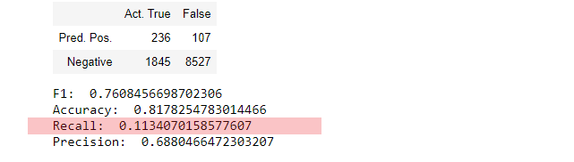


###### RandomForestClassifier

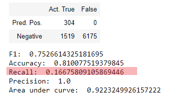


###### GBTClassifier

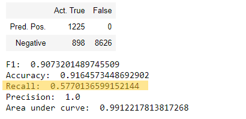

We can clearly see an immediate improvement for out-of-the-box training with GBTClassifier.

After some further experimentation I chose to train with a dataset where I simply removed a portion of the 
negatives. In the case of the Gradient Boosted Tree this worked out amazingly well. So well, that I am 
at this point unsure whether I might have made a mistake. Maybe the model overfit, or maybe I introduced some
kind of bias by undersampling to heavy? I can't figure it out because I did evaluation on the normal sampled set. 
A possible test at least for the recall metric
would be to find some users that other algorithms miss on a Type-2 error and test them against my model. 
Another good idea would be to examine how the model performs on the big dataset of 12GB.

###### GBTClassifier on undersampled data

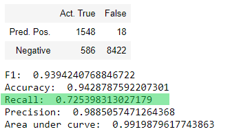

We can see a substantial improvement on the recall score, and this is why I chose to use *GBTClassifier* for final optimizations.
As the results were already so good these consisted simply of 

* Undersampled negatives ratios of .5 and .6 
* GBT parameter **maxDepth** with values of 2 and 5 
* GBT parameter **maxIter** with values of 30 and 120

I started out with cross validation but this took too long with even 3 folds so I switched to PySpark's simpler 
**TrainValidationSplit** which did speed up the search.

Also I found that using an undersampling ratio of 0.7 worked just as well, and since it means the training data will resemble the real data more, I choose to keep it instead.

The final results / parameters that were chosen were:
 ```
train/split ratio = 0.9/0.1
underasmpling ratio = 0.7
maxIter = 120 
maxDepth = 5
``` 

And the results on evaluating the normal-sampled test set were:

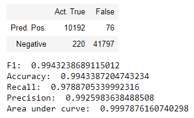

# Web App

The web app does live predictions from accumulated raw user values, and can also do look-ups of predictions by userId from a 
pre-calculated dataframe, which was stored as **predictions.parquet**. It also displays a list of users that will churn.

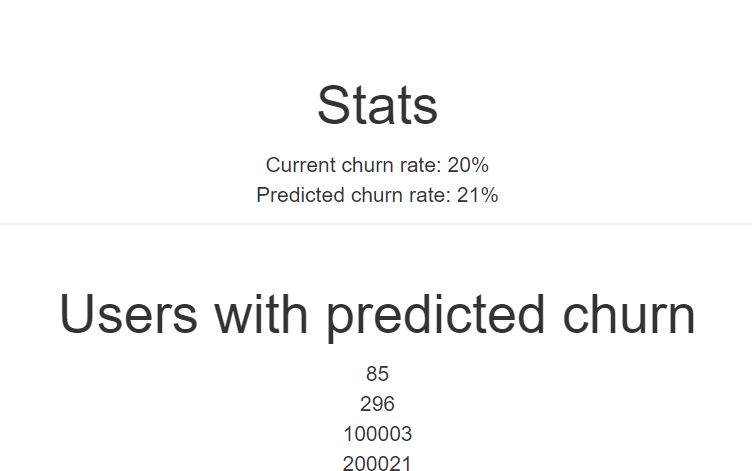

In the web app, you can enter a user id to look up their churn prediction:
```
296
```
should return a user that churns:

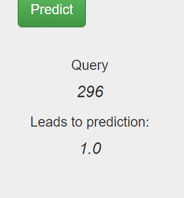

---

```
53
```
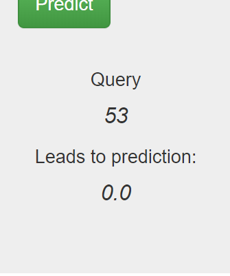

These predictions come from the pre-calcuated dataframe.

---

Alternatively, you can enter 8 "raw" values, which resemble a user's accumulated sums of the features that were discussed above:
```
0.0,1.0,10,40,54,6,4000,10
``` 
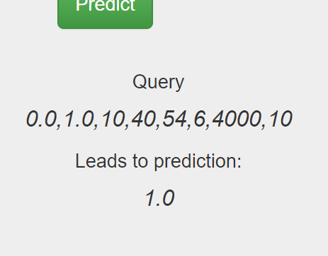

```
1.0,0.0,10,4,307,0,76200,10
``` 


These predictions are calculated on-the-fly in the web app and can be used for live testing.

---
**Note** I did not create an extra test set for the app, it is for illustration purposes only.


# Results

### Model Evaluation and Validation

As mentioned before, cross-validation took up too much time so I used **TrainValidationSplit** instead.
While this will not provide a validation as thorough as Cross-Validation, it does do basic validation on the model.
Please refer to the TrainValidationSplit Documentation for more information on TrainValidationSplit: [Link](https://spark.apache.org/docs/latest/ml-tuning.html#train-validation-split)

In addition, I manually repeated the final model training and evaluation so the results are sound from an empiric standpoint.
As mentioned further below, the next step should be to evaluate the model against unseen data from the 12GB set. 
However, I am fairly optimistic that the observed results seen above would hold up to at least a decent standard of a usable and stable prediction model.


# Conclusion

### Reflection

###### Summary

In this project I learned a lot about Spark, PySpark, ML and optimization in general as well as in churn projects.
My understanding of how to look at and explore data has been greatly enhanced, in that and other senses this
was a very rewarding project. I was very pleased with the positive outcome of how the model performed.
I think after absolving some more projects regarding customer churn, also incorporating time series calculations,
I will have a solid understanding of the topic. 

###### Most important takeaways were
* Spark is easy to learn and great to work with.
* GBT is a good algorithm to try on unbalanced label classification sets and churn problems.
* Undersampling can improve predictions of unbalanced sets, but may lead to bias.
* On unbalanced sets and/or churn data, a larger training set ratio (90%) can work well.
* The f1 score is not the most important metric, even if it is pretty high.
* Time spent on cleaning data and egineering features is time well spent.
* If the model is not performing well, there are a lot of things you can try, and one is likely to succeed. 
* Working on a reduced set in the beginning makes it possible to do a lot of experiments and tuning.

###### What I found difficult
* In a reduced size dataset I accidentally dropped all NaNs and dropped the cancellations too. For a while I thought I could not solve the problem.
 So I used a larger dataset and also made sure that these are still there after dropping.
* The churn label - Understanding how it works as a label. First I thought that since there are only 99 events/churned users
 that I could never get this to work, then it dawned on me that I needed to flag all events of a user in order to make it work at all.
 Since there is no key search by user as to if he will churn in the future, and I don't think an off-the shelf algorithm could even
 work with that. Alternative of course is using time frames, but even then data will be denormalized, just not over the whole set.
* Optimizing the unbalanced label set was challenging. At first this resulted in very low recall scores, and 
   for the most time when I was able to improve recall, precision also took a negative impact. With RandomForest
   I was able to do a little better, but in the end, Gradient Boosted Tree was able to handle this quite well.

###### What I found interesting
* To do the project on spark. I at first didn't have the column descriptions (found them later in udacity forum),
 So I learned a lot of working with pyspark in the ETL phase, especially interesting to drill down to the itemInSession column.
 Near the end of the project I found it very easy and enjoyable to work with spark.
* How the different algorithms behaved and were able to handle the unbalanced data, 
 especially how well GBT did when compared to the others.

### Improvement

* Include more fields that I dropped. f.i. from the artist field we could create more features:
	
    1. Find out distinct artists listened to by each user and use this as feature.
    2. Do a *TF-IDF* transform and see if the artists listened to directly has an impact on prediction.

* Treat data as time series: Extract dates from the timestamp field "ts" and build timeframe windows, e.g. weekly, monthly.
 Then treat this as a moving average. Data in windows could be accumulated, like number of songs listened to per week.
 This might, when contrasted with the current solution perform better because it is a refinement of the data
 and may allow the algorithm a more distinguished, and therefore likely more accurate prediction.
 Also it would enable easier forecasting, so instead of looking at the churn probability, we could ask *when* a user is
 likely to churn, or do some trend analysis.

* Implement a full undersampling method or use one that is available. In the tuning section I used a very crude method to undersample
 negatives, by just removing zeros by a ratio. There are better algorithms available for this.

* Extract some things that I do in the ETL stage into reusable functions and the use them in a pipeline.


---
# Acknowledgements

I have done research on the internet, mostly on stackoverflow. I did use some solutions as inspiration and some code snippets as template but the work in this project is all my own.
